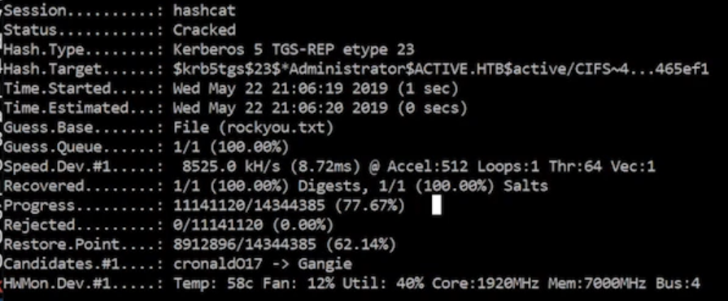

# Cybersecurity Learning and Practical Project Documentation

This project is a comprehensive collection of cybersecurity learning, tools usage, scanning techniques, exploitation, post-exploitation, Active Directory attacks, and defense techniques.  
It includes bash scripts, Python programs, Wireshark and Nmap scanning, exploitation frameworks, and pivoting techniques.  
The goal of this project is to demonstrate practical knowledge through hands-on exercises.

---

## Table of Contents
- [Part 1 - Network Scanning with Bash Scripts](#Part 1: Network Scanning with Bash Scripts)
- [Part 2 - Python Basics](#part-2---python-basics)
- [Part 3 - Python Port Scanner](#part-3---python-port-scanner)
- [Part 4 - Information Gathering](#part-4---information-gathering)
- [Part 5 - Network Scanning Tools](#part-5---network-scanning-tools)
- [Part 6 - Vulnerability Discovery](#part-6---vulnerability-discovery)
- [Part 7 - Exploitation and Gaining Access](#part-7---exploitation-and-gaining-access)
- [Part 8 - Active Directory Attacks](#part-8---active-directory-attacks)
- [Part 9 - NTLM Relay and Token Impersonation](#part-9---ntlm-relay-and-token-impersonation)
- [Part 10 - MS17-010 and Kerberoasting](#part-10---ms17-010-and-kerberoasting)
- [Part 11 - File Transfers, Pivoting, and Cleanup](#part-11---file-transfers-pivoting-and-cleanup)

---

# Part 1: Network Scanning with Bash Scripts

This section covers basic **network scanning techniques using bash scripts**. These techniques are often the **first step** in reconnaissance during cybersecurity assessments. We automate tasks like identifying live hosts and performing port scans to save time and reduce manual work.

---

## Bash Script: `ipsweep.sh`

The `ipsweep.sh` script is a **bash script** used to perform a **simple network sweep**. It checks for live hosts in a given subnet by sending ICMP Echo Requests (ping) and observing which hosts respond.

### Script Code:

```bash
#!/bin/bash

if [ "$1" == "" ]
then
  echo "You forgot an IP address!"
  echo "Syntax: ./ipsweep.sh 192.168.1"
else
  for ip in `seq 1 254`; do
    ping -c 1 $1.$ip | grep "64 bytes" | cut -d " " -f 4 | tr -d ":" &
  done
fi
```

### How `ipsweep.sh` Works:

- **Input Validation:**
  - The script first checks if the user has entered a base IP address (e.g., `192.168.1`).
  - If not provided, it prompts the user with correct usage syntax: `./ipsweep.sh 192.168.1`.

- **Host Discovery:**
  - Using a `for` loop and the `seq` command, it iterates from 1 to 254, representing the last octet of an IP address.
  - It **pings** each generated IP once (`-c 1` means send one packet).
  - The output is **filtered** to find responses that contain `64 bytes`, meaning a successful ping.
  - The `cut` command extracts the IP address of the responding host.
  - The `tr` command removes the trailing colon from the IP address.

- **Parallel Execution:**
  - Each ping command runs in the background (`&`), allowing multiple pings to be executed simultaneously for faster results.

### Example Usage:

```bash
chmod +x ipsweep.sh
./ipsweep.sh 192.168.1
```

- This will scan from `192.168.1.1` to `192.168.1.254` and output the IPs that are alive.

### Important Points:

- **Fast Scanning:** The use of background processes makes scanning quicker compared to sequential execution.
- **Simple and Lightweight:** Ideal for small networks and initial testing.
- **Limitations:**
  - Only detects hosts that respond to ICMP (ping).
  - Some devices or firewalls may block ICMP, causing false negatives.

---

## Bash Script: Quick Nmap Scanner

Another quick method for **port scanning** known hosts is using `nmap` in a loop over a list of IPs.

### Script Code:

```bash
for ip in $(cat iplist.txt); do nmap -p 80 -T4 $ip & done
```

### How This Nmap Script Works:

- **Reads IP addresses** from a file called `iplist.txt`. Each IP should be on a new line.
- **Scans** port 80 (HTTP) on each IP address using **Nmap**, a powerful network scanning tool.
- **-T4 option:** Speeds up the scan. Nmap has timing templates from `-T0` (paranoid) to `-T5` (insane).
- **Background Execution (`&`):** Each scan runs in the background, improving speed by scanning multiple targets simultaneously.

### Example Usage:

```bash
echo "192.168.1.10" > iplist.txt
echo "192.168.1.11" >> iplist.txt
echo "192.168.1.12" >> iplist.txt

chmod +x yournmapscan.sh
./yournmapscan.sh
```

---

## Additional Suggestions and Enhancements:

To make the `ipsweep.sh` and Nmap scanner scripts more robust and feature-rich, you could add:

- **Color Coding Results:** Highlight alive hosts in green, dead hosts in red.
- **Save Outputs to a File:** Redirect outputs to a timestamped file for later analysis.
- **Multiple Ports Scan:** Allow scanning multiple ports instead of just port 80.
- **Error Handling:** Better error messages for wrong input.
- **Hostnames Resolution:** Try resolving IPs to hostnames using `nslookup` or `dig`.
- **ICMP Flood Protection:** Implement sleep or rate limiting to avoid overwhelming the network.

Example for saving results:

```bash
for ip in $(cat iplist.txt); do nmap -p 80 -T4 $ip >> results.txt & done
```

---

# Summary for Part 1

In this part, you learned how to:

- Perform a simple but efficient network sweep using a Bash script.
- Identify live hosts in a subnet quickly.
- Use Nmap to scan specific ports across multiple IP addresses.
- Optimize scripts using background processes.

These small automation scripts form the building blocks of larger penetration testing toolsets.

---

# Next Steps
In the upcoming parts, we'll dive deeper into using **Python** to automate port scanning, information gathering, and further into exploitation techniques.


---

## Part 2: Python Basics

### Python Scripts for Network Tasks and Fuzzing

---

### **`bof.py` - Buffer Overflow Fuzzing Script**

```python
#!/usr/bin/python
import sys, socket
from time import sleep

buffer = "A" * 100

while True:
    try:
        s = socket.socket(socket.AF_INET, socket.SOCK_STREAM)
        s.connect(('192.168.1.1', 9999))
        s.send(('TRUN /.:/' + buffer))
        s.close()
        sleep(1)
        buffer = buffer + "A" * 100

    except:
        print("Fuzzing crashed at %s bytes" % (str(len(buffer))))
        sys.exit()
```

**Detailed Description:**
- **Purpose:**
  - This script is used for fuzzing a vulnerable service running on IP `192.168.1.1` port `9999`.
  - It helps to find the crash point of a service by sending increasing lengths of data ("A" characters) to trigger a buffer overflow.

- **Working:**
  - Starts with a buffer of 100 'A's.
  - Continuously tries to:
    - Create a TCP socket.
    - Connect to the target IP and port.
    - Send the payload to the vulnerable "TRUN" command of the service.
    - Close the socket and wait for 1 second.
    - Increase the buffer by another 100 'A's each loop.
  - If the service crashes (socket connection fails), it prints the number of bytes at which it crashed and exits.

- **Importance in Cybersecurity:**
  - Finding the crash point is the first step in building an exploit for a buffer overflow vulnerability.
  - Used heavily in penetration testing and exploit development.

- **Potential Improvements:**
  - Add command-line arguments for dynamic IP and port selection.
  - Log results to a file for later analysis.

---

### **`sweep.py` - Subnet Ping Sweeper**

```python
import subprocess
import datetime
import re
import argparse

def write_result(filename, ping):
    with open(filename, "w") as f:
        f.write(f"Start time {datetime.datetime.now()}\n")
        for result in ping:
            f.write(result)
        f.write(f"End time {datetime.datetime.now()}\n")

def ping_subnet(subnet):
    for addr in range(1, 255):
        yield subprocess.Popen(["ping", f"{subnet}.{addr}", "-n", "1"], stdout=subprocess.PIPE) \
        .stdout.read()																			\
        .decode()

def main(subnet, filename):
    write_result(filename, ping_subnet(subnet))

def parse_arguments():
    parser = argparse.ArgumentParser(usage='%(prog)s [options] <subnet>',
                                     description='IP checker',
                                     epilog="python ipscanner.py 192.168.1 -f somefile.txt")
    parser.add_argument('subnet', type=str, help='The subnet you want to ping')
    parser.add_argument('-f', '--filename', type=str, help='The filename')
    args = parser.parse_args()

    if not re.match(r"(\d{1,3}\.\d{1,3}\.\d{1,3})", args.subnet) \
       or any(a not in range(1, 255) for a in map(int, args.subnet.split("."))):
        parser.error("This is not a valid subnet")

    if " " in args.filename:
        parser.error("There cannot be whitespace in the filename")

    return args.subnet, args.filename

if __name__ == '__main__':
    main(*parse_arguments())
```

**Detailed Description:**
- **Purpose:**
  - This script pings every IP address in a given subnet (from `.1` to `.254`).
  - It records the ping results along with timestamps into a specified file.

- **Working:**
  - `ping_subnet(subnet)` generates ping results for every address in the subnet.
  - `write_result(filename, ping)` writes the ping results with start and end times.
  - `parse_arguments()` uses `argparse` to safely handle user input for the subnet and filename, ensuring:
    - Subnet format is correct (e.g., `192.168.1`).
    - No spaces in the filename.
  - The main function ties these together.

- **Importance in Cybersecurity:**
  - Useful for quickly mapping active devices in a subnet.
  - Important for network reconnaissance, vulnerability assessment, and penetration testing.

- **Potential Improvements:**
  - Add parallel pinging to speed up the process.
  - Add options to specify ports and timeout values.
  - Color-code successful and failed pings in the terminal output.

---

### Summary of Part 2:
- **Key Focus Areas:**
  - Scripting for network automation (ping sweepers).
  - Introduction to buffer overflow fuzzing techniques.
  - Using Python's standard libraries like `socket`, `subprocess`, `argparse`, `re`, and `datetime` effectively.

These foundational Python scripts are stepping stones towards creating sophisticated cybersecurity tools for automation, exploitation, and reconnaissance.
---

## Part 3: Python Port Scanner

**Python Script:**

- Simple TCP port scanner using sockets.
- Scans a range of ports on a specified IP address to identify open services.

---

## Part 4: Information Gathering and Reconnaissance

- **Google Dorking:**
  ```
  site:tesla.com filetype:pdf
  ```
- **Subdomain Enumeration:**
  - [crt.sh](https://crt.sh/)
- **Email and Domain Harvesting:**
  ```bash
  theharvester -d tesla.com -l 500 -b duckduckgo
  ```
- **Technology Detection:**
  - Wappalyzer (browser extension)
  - WhatWeb (command-line tool):
    ```bash
    whatweb -v tesla.com
    ```
  - [BuiltWith.com](https://builtwith.com/)

---

## Part 5: Network Scanning and Analysis Tools

- **Wireshark:** Packet capture and analysis.
- **Nmap:**
  ```bash
  nmap -sn 192.168.1.0/24
  nmap -T4 192.168.1.100
  nmap -T4 -A -p- 192.168.1.100
  nmap -T4 -A -p23,80,443,843,1234,1300,9876 192.168.1.100
  nmap -T4 -p- 192.168.1.100 -oA client
  nmap -sU -T4 192.168.1.100
  nmap -p 443 --script=ssl-enum-ciphers tesla.com
  ```
- **Metasploit Framework:** Advanced network scanning and exploitation.
- **Nikto:** Web server vulnerability scanning.
- **Burp Suite:** Web application proxy testing.

---

## Part 6: Vulnerability Discovery and Enumeration

- **Netdiscover:** Live hosts discovery.
- **Nessus:** Vulnerability assessment.
- **Dirbuster:** Directory brute-forcing.
- **Exploit Databases:**
  - [CVE Details](https://cvedetails.com/)
  - [Exploit-DB](https://exploit-db.com/)

- **SMB Enumeration:**
  ```bash
  smbclient -L \\192.168.202.130
  smbclient -L \\192.168.202.130\ADMIN$
  smbclient -L \\192.168.202.130\IPC$
  ```

- **Metasploit SMB Version Scanner:**
  ```bash
  use auxiliary/scanner/smb/smb_version
  ```

Scanning and targeting machines:
```bash
nmap -T4 -p- 10.10.10.133
nmap -A -T4 -p22,80,60080 10.10.10.133
```

---

## Part 7: Exploitation, Reverse Shells, and Credential Stuffing


- Gaining initial access through vulnerabilities found during enumeration.


Testing and running exploits:


Testing different payloads (staged vs non-staged):


---

**Targeting a new machine:**
```bash
nmap -T4 -p- -A 10.10.10.3
```

Anonymous login exploitation:


Credential collection from password dumps:


Running breach-parse:


Login attempt using Burp Suite proxy:


---

## Part 8: Building an Active Directory Lab and LLMNR Poisoning

Installing and setting up:


Capturing NTLMv2 hashes with Responder:


Accessing captured hashes:


---

Cracking captured hashes using:

- **Hashcat**
- **John The Ripper**


Result after successful crack:


**Defense Mechanisms:**


---

## Part 9: NTLM Relay, Token Impersonation, and PsExec

Reading on internal network exploitation techniques:


Using CrackMapExec for enumeration:


Setting up PsExec module via Metasploit:


Continuing session from previous exploitation:


Adjustments on Windows Server for relay:


Running Responder for relay:


---

## Part 10: MS17-010 (EternalBlue), GPP cPasswords, and Kerberoasting

Finding vulnerabilities via Nmap:


Exploiting MS17-010 using Metasploit:


Trying alternative exploits:


Shell access and privilege escalation:


Working on additional machines:


Decrypting captured credentials:


Kerberoasting attack workflow:




Final system access using PsExec:


---

## Part 11: File Transfers, Pivoting, and Cleanup

### File Transfers

**GET method:**


**FTP Method:**


**Using Metasploit for File Transfer:**


### Pivoting

Maintaining access and pivoting inside internal networks:


### Cleanup and Reporting

- Remove all scripts, executables, and temporary files.
- Securely delete files if possible.
- Restore system settings and configurations.
- Remove any user accounts or backdoors created.

---

# Final Notes

This project captures an end-to-end cybersecurity testing lifecycle:
- Reconnaissance
- Scanning
- Enumeration
- Exploitation
- Post-Exploitation
- Lateral Movement
- Privilege Escalation
- Cleanup and Documentation

**Author:** _Your Name Here_

**Disclaimer:** _This project was completed in a controlled lab environment and is intended for educational purposes only._

